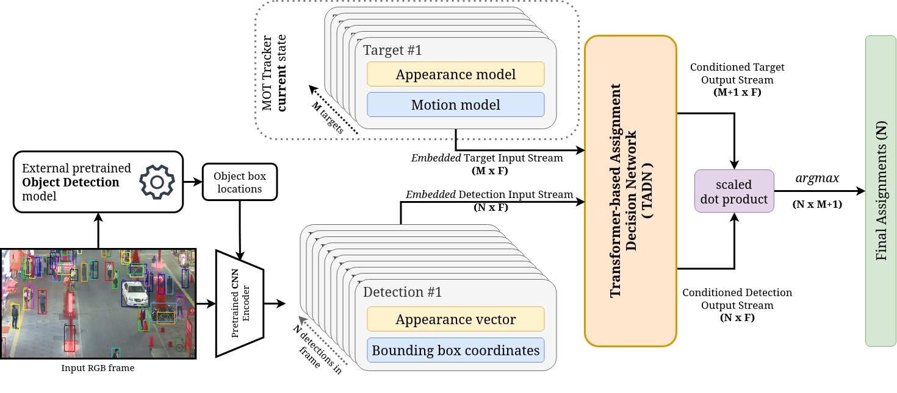
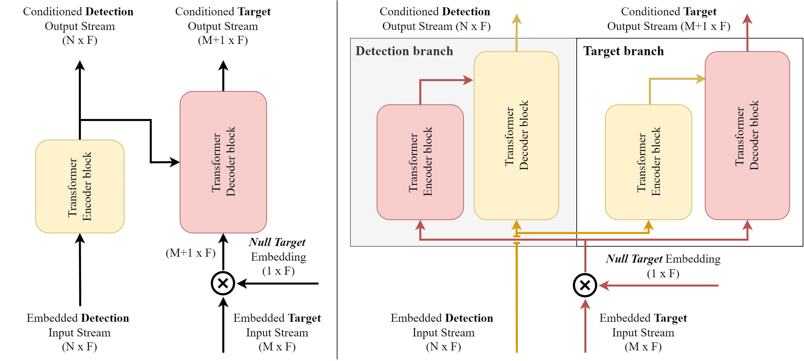

# Transformer based Decision Networks for MOT

Data association is a crucial component for any multiple object tracking (MOT) method that follows the tracking-by-detection paradigm. To generate complete trajectories such methods employ a data association process to establish assignments between detections and existing targets during each timestep. Recent data association approaches try to solve a multi-dimensional linear assignment task or a network flow minimization problem or either tackle it via multiple hypotheses tracking. However, during inference an optimization step that computes optimal assignments is required for every sequence frame adding significant computational complexity in any given solution. 




Transformer-based Assignment Decision Network (TADN) tackles data association without the need of any explicit optimization during inference. In particular, TADN can **directly infer assignment pairs** between detections and active targets in a single forward pass of the network. TADN is integrated in a rather simple MOT framework coupled with a novel training strategy for efficient end-to-end training.



## Benchmark results


Results on [MOT17 dataset](https://motchallenge.net/data/MOT17/) with public detections based on CLEAR metrics : 

| Tracker     | MOTA          | IDF1          | MT            | ML            | FP             | FN              | IDSW          | Frag          | Hz            |
|-------------|---------------|---------------|---------------|---------------|----------------|-----------------|---------------|---------------|---------------|
| DASOT       | 48.0          | 51.3          | 19.9          | 34.9          | 38830          | 250533          | 3909          | -             | 9.1           |
| DeepMOT     | 48.1          | 43.0          | 17.6          | 38.6          | 26490          | 262578          | 3696          | 5353          | 4.9           |
| DMAN        | 48.2          | 55.7          | 19.3          | 38.3          | 26218          | 263608          | 2194          | 5378          | 0.3           |
| TL-MHT      | 50.6          | **56.5** | 17.6          | 43.4          | 22213          | 255030          | **1407** | **2079** | -             |
| MHT-DAM     | 50.7          | 47.2          | 20.8          | 36.9          | 22875          | 252889          | 2314          | 2865          | 0.9           |
| FAMNet      | 52.0          | 48.7          | 19.1          | 33.4          | 14138          | 253616          | 3072          | 5318          | $0.1        |
| DAN         | 52.4          | 49.5          | 21.4          | 30.7          | 25423          | 234592          | 8491          | 14797         | 6.3           |
| Tracktor++  | 53.5          | 52.3          | 19.5          | 36.6          | **12201** | 248047          | 2072          | 4611          | 1.5           |
| **TADN (Ours)** | **54.6** | 49.0          | **22.4** | **30.2**} | 36285          | **214857** | 4869          | 7821          | **10.0** |


Results on [UA-DETRAC dataset](https://detrac-db.rit.albany.edu/) :

| Detector + Tracker | PR-MOTA       | PR-MOTP       | PR-MT         | PR-ML        | PR-FP         | PR-FN           | PR-IDSW      |
|--------------------|---------------|---------------|---------------|--------------|---------------|-----------------|--------------|
| CompACT + H2T      | 12.4          | 35.7          | 14.8          | 19.4         | 51765         | 173899          | 852          |
| CompACT + CMOT     | 12.6          | 36.1          | 16.1          | 18.6         | 57885         | 167110          | **285** |
| CompACT + GOG      | 14.2          | 37.0          | 13.9          | 19.9         | 32092         | 180183          | 3334         |
| EB + IOUT          | 19.4          | 28.9          | 17.7          | 18.4         | 14796         | 171805          | 2311         |
| CompACT +FAMNet    | 19.8          | 36.7          | 17.1          | 18.2         | 14989         | 164433          | 617          |
| EB + DAN           | 20.2          | 26.3          | 14.5          | 18.1         | **9747** | **135978** | 518          |
| EB + Kalman-IOUT   | 21.1          | 28.6          | 21.9          | 17.6         | 19046         | 159178          | 462          |
| **EB + TADN (Ours)**   | **23.7** | **83.2** | **61.2** | **8.2** | 314117        | 198714          | 2910         |

> **Note :** UA-DETRAC challenge expands upon CLEAR metrics using the detector's Precision-Recall curve. Each metric value is the mean value for 10 equally spaced detection thresholds.


## Installation

To install **tadn-mot** you must first install its dependencies as found in ```requirements.txt```. For ease, you can use docker.

### Docker

To use **tadn-mot** with docker, first you must build the appropriate docker image

```bash
docker build . -t tadn-mot
```

To start a TADN-MOT container in interactive mode:
```bash
docker run -it [GPU_RELATED_OPTS] [MISC OPTIONS] tadn-mot bash
```
## Usage

TADN is configured for training in either MOT17 or UA-DETRAC benchmarks. To speed up thetraining process and allow for quick experimentation many inputs can be precomputed. However, TADN can be deployed to provide real-time tracking with minimal effort.

### Prepare Data
- MOT 17: Download dataset from this [link](https://motchallenge.net/data/MOT17/) and unzip.
- UA-DETRAC: Download dataset from this [link](https://detrac-db.rit.albany.edu/) and unzip.

> **Note :** For MOT17 benchmark detections from FRCNN, SDP, and DPM are provided. For UA-DETRAC detections from CompACT, RCNN, DPM and ACF detectors are provided. To use *EB* detections download detections from [here](https://github.com/bochinski/iou-tracker#eb-detections).

> **Note 2 :** To enable validation for UA-DETRAC using the trackeval repo, you must firts run the following convenience script: 
```python
python -m tadn.scripts.detrac_generate_MOTC_gt PATH_TO_DATASET_ROOT --dset_mode "train"
python -m tadn.scripts.detrac_generate_MOTC_gt PATH_TO_DATASET_ROOT --dset_mode "test"
```

### Choose appearance features CNN encoder:
1. ImageNet pretrained ResNet-18 
    - No further actions needed
    - Mediocre performance
2. Re-id pretrained ResNet-50
    - Use these [instructions](https://github.com/phil-bergmann/tracking_wo_bnw#training-the-re-identification-model) to pretrain the model on MOT17
    - Better performance (~ 5%)

### Precompute appearance vectors:
- MOT17 & Re-id CNN features
```python
python -m tadn.scripts.precompute_appearance_vectors --dset_type mot-challenge --dset_version MOT17 --feature_extractor reid --reid_ckpt PATH_TO_REID_CHECKPOINT
```

- MOT17 & Resnet-18 CNN features
```python
python -m tadn.scripts.precompute_appearance_vectors --dset_type mot-challenge --dset_version MOT17 --feature_extractor resnet18
```

- UA-DETRAC & Re-id CNN features
```python
python -m tadn.scripts.precompute_appearance_vectors --dset_type detrac --detector EB --feature_extractor reid --reid_ckpt PATH_TO_REID_CHECKPOINT
```

- MOT17 & Resnet-18 CNN features
```python
python -m tadn.scripts.precompute_appearance_vectors --dset_type mot-challenge --dset_version MOT17 --feature_extractor resnet18
```

### Camera Motion Compensation

If you intend to use CMC in your model, you must first precompute frame to frame affine transforms for the target benchmark using the ***ECC*** method.

- MOT17
```python
python -m tadn.scripts.precompute_ecc PATH_TO_DATASET_ROOT --dset_type mot-challenge --dset_mode "train" --dset_version MOT17
python -m tadn.scripts.precompute_ecc PATH_TO_DATASET_ROOT --dset_type mot-challenge --dset_mode "val" --dset_version MOT17
```

- UA-DETRAC
```python
python -m tadn.scripts.precompute_ecc PATH_TO_DATASET_ROOT --dset_type detrac --dset_mode "train"
python -m tadn.scripts.precompute_ecc PATH_TO_DATASET_ROOT --dset_type detrac --dset_mode "test"
```

### Train a TADN model

This repository uses a JSON based configuration system for defining:
- Model architecture
- Training parameters
- Dataset configuration
- Data input pipeline
- Logger configuration
- Miscelaneous hyperparameters

> **Note :** JSON config examples can be found in the ```sample_configs``` directory


#### Train on MOT17 or UA-DETRAC:
```python
python -m tadn.online_training PATH_TO_JSON_CONFIG
```

### Inference

Inference with a pre-trained TADN module supports the MOTChallenge format for the output results.

To perform inference on the *val/test* subsets:
```python
python -m tadn.scripts.inference PATH_TO_CKPT PATH_TO_JSON_CONFIG 
```

To perform inference on the whole dataset:
```python
python -m tadn.scripts.inference PATH_TO_CKPT PATH_TO_JSON_CONFIG --inference_train
```

### Evaluation

To evaluate a pre-trained TADN model on either MOT17 or UA-DETRAC datasets:
```python
python -m tadn.scripts.validate PATH_TO_CKPT PATH_TO_JSON_CONFIG
```
> **Note :** Which dataset you evaluate is configured in the JSON config

> **Note 2:** For MOT17, test set is unavailable. You can use ```"split": "half"``` to perform evaluation on a 50/50 split of MOT17 dataset. Similarly you can train a model on that split to replicate ablation study experiments. To evaluate on the official MOT17 test set, please use the "inference" script to submit inference results to the official evaluation server.


### Validate training strategy

To estimate expected tracking performance when training TADN using the online training strategy you can run:
```python
python -m tadn.scripts.validate_LAM PATH_TO_JSON_CONFIG
```
### Pre-trained TADN models

***COMING SOON!!!***


# Cite us!

If you use this software in your research, please cite our preprint publication:
 
Psalta, A., Tsironis, V., & Karantzalos, K. (2022). *Transformer-based assignment decision network for multiple object tracking.* arXiv preprint arXiv:2208.03571.
 
Bibtex: 
 ```
@article{psalta2022transformer,
  title={Transformer-based assignment decision network for multiple object tracking},
  author={Psalta, Athena and Tsironis, Vasileios and Karantzalos, Konstantinos},
  journal={arXiv preprint arXiv:2208.03571},
  year={2022}
}
 ```
